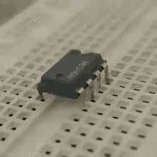
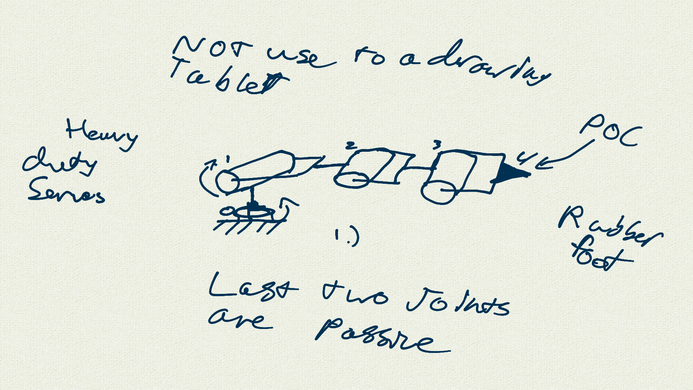
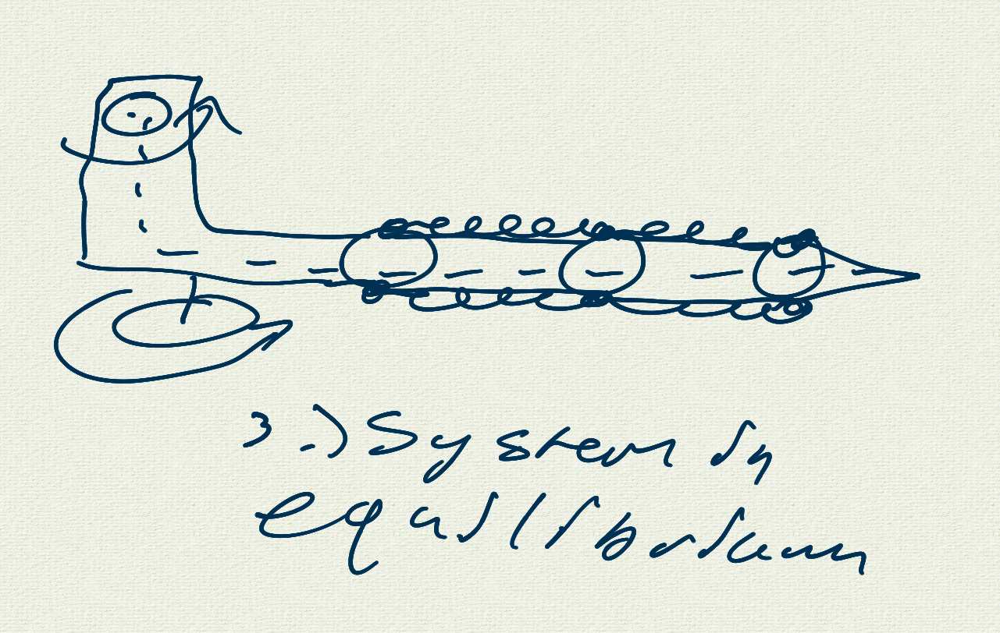
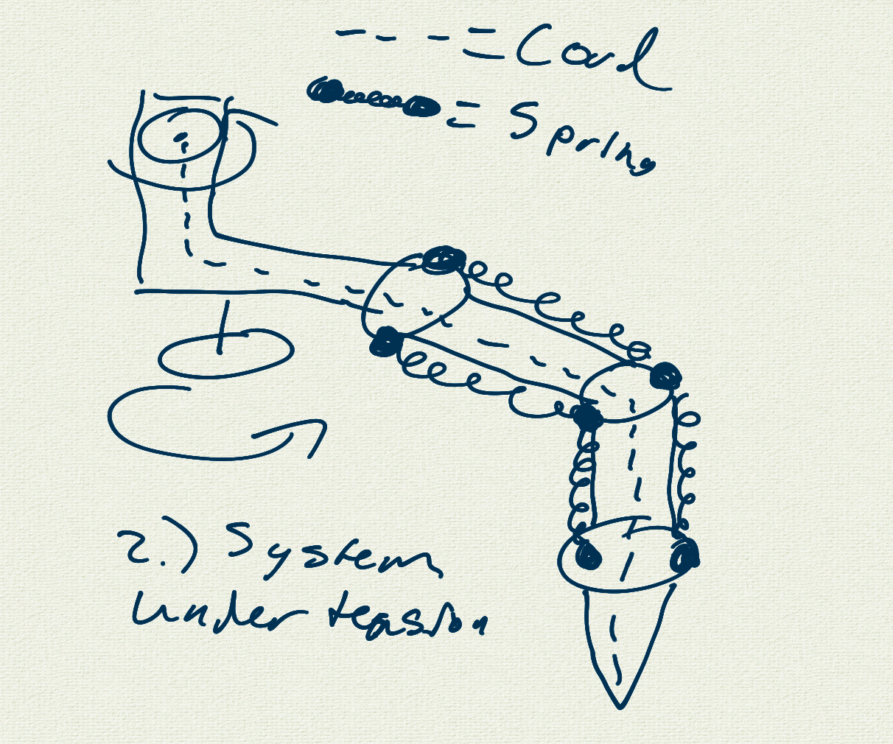

# Walking IC
I hope to remake a walking IC from a famous gif in the STEM community of an NE555N walking across a breadboard. I will document my ramblings and code here. :)  

  

  
I will be making VLOGS and ranting in this README.md for the duration of this projects construction. Later I hope to be more organized, however, I truely, am not.

# VLOG (Day 0)

# Preliminary Sketches (Day 1)

  

  

  

# I regret to inform you I have ADHD
I have not made progress on this project since inception and got side tracked with fpv drones, autonomous drones, and meshtastic. I may pivot towards that and come back to this later :)
